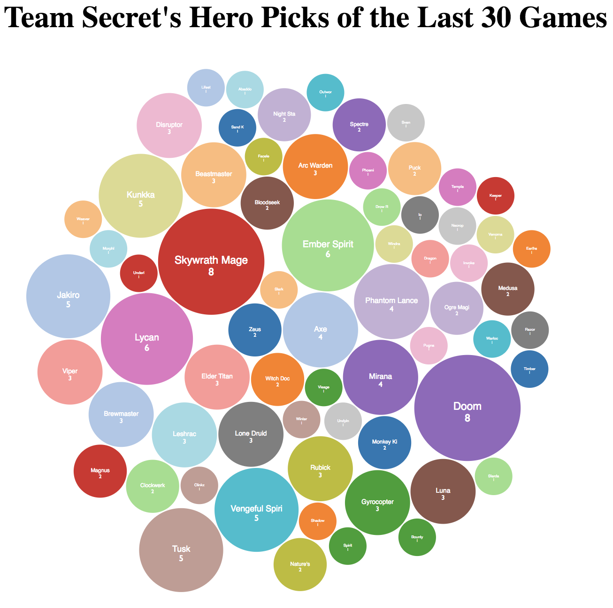

# heroes-by-team-with-d3
This was created during my time as a student at Code Chrysalis.

Displays a visualization with D3 of heroes used in the last 30 official matches by Team Secret.

[Click here to check it out!](https://dota-hero-picks-by-team-d3.herokuapp.com/)

Each circle represents a single hero choice and includes the name and number of times picked. Larger circles signify a large number of picks.

## How to run:
1. add all dependencies using `npm install` or `yarn` in the terminal.
1. run the http server by using `yarn start` or `npm start`.

## Made with: 
- [The OpenDota API](https://www.opendota.com/)
- [D3](https://d3js.org/)
- [Webpack](https://webpack.js.org/)

### Future Goals
- Create a home page with all teams competing in The International this year.
- Add functionality for all teams competing in The International this year.